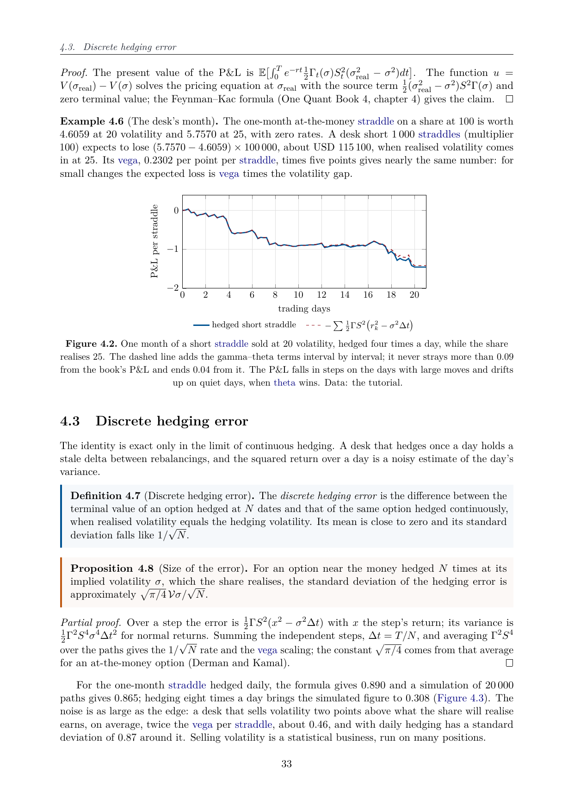
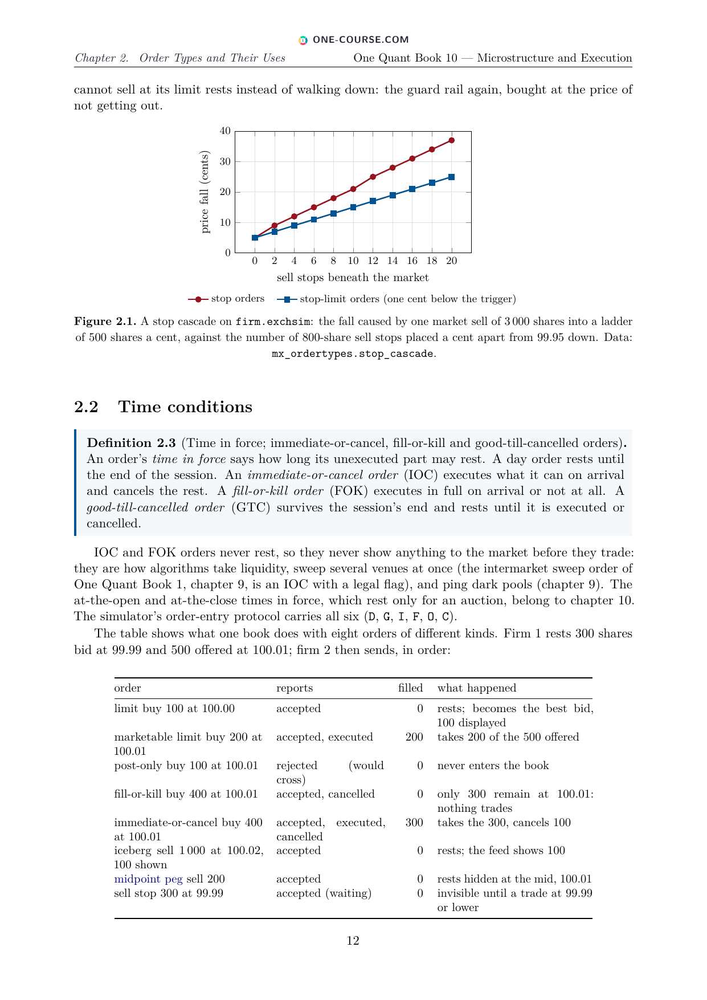
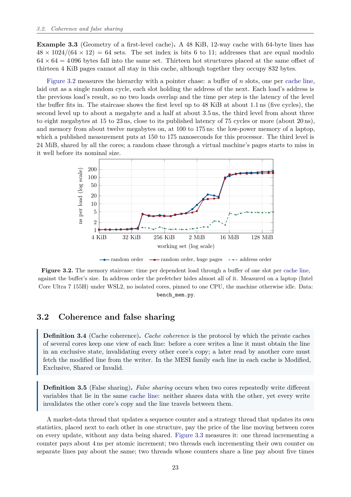

# One Quant Book

<p align="center">
  <a href="https://www.one-course.com">
    
  </a>
</p>

<p align="center">
  <a href="https://github.com/bvirrion/one-quant-book/releases/latest"></a>
  <a href="https://github.com/bvirrion/one-quant-book/releases"></a>
  <a href="https://github.com/bvirrion/one-quant-book/actions/workflows/ci.yml"></a>
  <a href="https://www.one-course.com"></a>
</p>

*The One Quant Book to Rule Them All.*

> **One Quant Book** is part of the **One Course** project — one coherent
> course covering each subject from kindergarten to the end of the
> bachelor's degree, and here beyond it, into a profession. Discover the
> whole project at **[www.one-course.com](https://www.one-course.com)**, and
> see the siblings [One Math Book](https://github.com/bvirrion/one-math-book)
> and [One Physics Book](https://github.com/bvirrion/one-physics-book).

A series of eighteen **free books on quantitative finance**, written for
readers who already code and hold a master's-level mathematics background:
the markets and their plumbing, the methods, derivatives and risk, the craft
of research, strategies, microstructure and execution, market making and
high-frequency trading, machine learning, and low-latency software, then the
infrastructure, the platforms, the firm, the industry and the interviews.
**Books 1–13 are written**, in English; Books 14–18 are in preparation.

Every book is built the same way:

- **Sourced facts.** Every checkable fact about markets goes through a
  per-chapter source ledger (URL and access date), volatile facts sit in
  dated boxes, and a firm is named only with a citable public source.
- **Tested code.** No code is printed unless it is included from a tested
  file — Python, C++20 and Rust — and the books build a running "miniature
  firm" together: pricers, a risk engine, a backtester, an exchange
  simulator with its binary feed and order-entry protocol, strategies,
  models and a low-latency trading path.
- **Numbers you can reproduce.** Every chart is drawn from data the book's
  own code generates, and every printed number is asserted by a test.
- **Practice.** Graded exercises, an end-of-chapter problem and interview
  questions in every chapter, with full solutions at the end of each book.
  Thousands of generated hyperlinks send every defined term back to its
  definition.

<p align="center">
  
  
  
</p>
<p align="center"><sub>Three pages: discrete hedging error (Book 5), a stop cascade on the exchange simulator (Book 10), the memory hierarchy measured (Book 13).</sub></p>

## Download the PDFs

| Book | Chapters | Download PDF |
|------|---------:|--------------|
| **1. Markets I** — The Ecosystem and Exchange-Traded Markets | 31 | [PDF](https://github.com/bvirrion/one-quant-book/releases/latest/download/one_quant_book_01_markets_1.pdf) |
| **2. Markets II** — Rates, FX and Credit | 31 | [PDF](https://github.com/bvirrion/one-quant-book/releases/latest/download/one_quant_book_02_markets_2.pdf) |
| **3. Markets III** — Commodities, Energy and Crypto | 29 | [PDF](https://github.com/bvirrion/one-quant-book/releases/latest/download/one_quant_book_03_markets_3.pdf) |
| **4. Quantitative Methods** | 29 | [PDF](https://github.com/bvirrion/one-quant-book/releases/latest/download/one_quant_book_04_methods.pdf) |
| **5. Derivatives and Volatility** | 28 | [PDF](https://github.com/bvirrion/one-quant-book/releases/latest/download/one_quant_book_05_derivatives.pdf) |
| **6. Rates, Credit, XVA and Risk** | 29 | [PDF](https://github.com/bvirrion/one-quant-book/releases/latest/download/one_quant_book_06_rates_credit_risk.pdf) |
| **7. Research Craft** — Predictors, Backtests, Measurement, Portfolios | 29 | [PDF](https://github.com/bvirrion/one-quant-book/releases/latest/download/one_quant_book_07_research.pdf) |
| **8. Strategies I** — Equities and Futures | 29 | [PDF](https://github.com/bvirrion/one-quant-book/releases/latest/download/one_quant_book_08_strategies_1.pdf) |
| **9. Strategies II** — Volatility, Relative Value, Macro and the Bank Desks | 29 | [PDF](https://github.com/bvirrion/one-quant-book/releases/latest/download/one_quant_book_09_strategies_2.pdf) |
| **10. Microstructure and Execution** | 28 | [PDF](https://github.com/bvirrion/one-quant-book/releases/latest/download/one_quant_book_10_microstructure.pdf) |
| **11. Market Making and High-Frequency Trading** | 29 | [PDF](https://github.com/bvirrion/one-quant-book/releases/latest/download/one_quant_book_11_hft.pdf) |
| **12. Machine Learning for Markets** | 29 | [PDF](https://github.com/bvirrion/one-quant-book/releases/latest/download/one_quant_book_12_ml.pdf) |
| **13. Low-Latency Software** | 26 | [PDF](https://github.com/bvirrion/one-quant-book/releases/latest/download/one_quant_book_13_low_latency.pdf) |
| 14. Networks, Hardware and Trading Infrastructure | 29 | 🚧 in preparation |
| 15. Research, Data and Risk Platforms | 30 | 🚧 in preparation |
| 16. The Desk and the Firm | 30 | 🚧 in preparation |
| 17. The Industry: Firms, Roles and Careers | 30 | 🚧 in preparation |
| 18. The Interview Book | 29 | 🚧 in preparation |

The PDF links always point at the newest release; every release also keeps
each PDF under a versioned name (e.g. `one_quant_book_05_derivatives_v0.0.4.pdf`).
Spotted a mistake? Please
[report an erratum](https://github.com/bvirrion/one-quant-book/issues/new?template=errata.yml) —
fixes usually ship within days.

## Building the books

Requirements: a TeX Live installation with `latexmk` (pdfLaTeX; packages
used: `tcolorbox`, `pgfplots`, `listings`, `cleveref`, `imakeidx`, …).

```sh
make            # or just: latexmk — builds all written books
```

The PDFs are produced at `build/one_quant_book_<NN>_<slug>.pdf`. To build a
single book, e.g. `latexmk one_quant_book_05_derivatives.tex`; `make clean`
removes auxiliary files and `make distclean` the whole `build/` directory.

The code has its own checks (Python 3.10 with the pinned versions of
`requirements.txt`, a C++20 compiler and Rust):

```sh
make venv          # create .venv with the exact package versions
make test-fast     # what CI runs: ruff, pytest, C++ and Rust tests, listing ranges, chart CSVs
make test-code     # the same plus the full-size runs that reproduce every printed number
make reproduce     # test-code, then regenerate every chart's data: must leave no diff
```

## Repository layout

```
one_quant_book_<NN>_<slug>.tex   entry file per book
styles/onequant.sty              packages, environments, macros
parts/<slug>/NN-*.tex            chapters; parts/<slug>/solutions/ the solutions
code/<slug>/NN-*/                each chapter's tested code (python/, cpp/, rust/, tests/)
code/firm/                       the running "miniature firm" the books build together
figdata/<slug>/NN-*/             chart data, generated by the chapters' code
sources/<slug>/                  per-chapter source ledgers
OUTLINE.md, outline/             the eighteen books and their chapters
```

## Contributing

Corrections, better derivations, additional exercises and sources are
welcome. Please read [CONTRIBUTING.md](CONTRIBUTING.md) for the structure,
notation and conventions of the series. The fastest way to help is to
[report an erratum](https://github.com/bvirrion/one-quant-book/issues/new?template=errata.yml)
when you spot a mistake.

## Contributors

- Benjamin Virrion
- Claude (Anthropic)

## License

Not yet decided.
